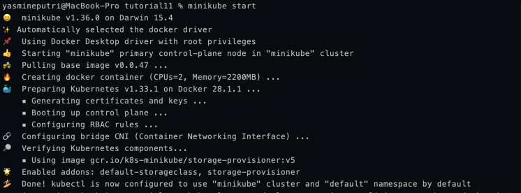
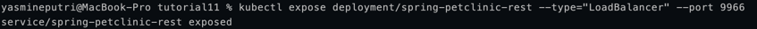

## Reflection 1
1. Differences:

    Before Exposing Service:
    - Logs show only startup messages from the hello-node pod (e.g., agnhost starting on port 8080).
    - No external access, so no request logs.
  
    After Exposing Service:
    - Service created, app accessible at http://127.0.0.1:55631.
    - Logs still show startup messages.
    - Each time we open the app (browser or curl), a new log entry is added for the HTTP request.
    
    Log Increase:
    - Yes, logs grow with each app access, as every request is logged.

2. The -n option in kubectl get specifies the namespace to query (e.g., -n kube-system).

    Purpose of -n:
    - It tells kubectl to list resources (like pods or services) only in the specified namespace, not across all namespaces.
  
    Why pods/services we created aren't listed:
    - Our hello-node deployment and service are in the default namespace.
    - When ywe run kubectl get pods -n kube-system or kubectl get services -n kube-system, it only shows resources in the kube-system namespace (used for Kubernetes system components), not the default namespace where your resources reside.

## Reflection 2
1. Differences:

   Rolling Update:
   - Updates pods gradually, replacing old ones with new ones in small batches. 
   - Ensures some pods remain running, minimizing downtime. 
   - Default Kubernetes strategy.
   
   Recreate:
   - Terminates all old pods at once, then creates new ones. 
   - Causes downtime since no pods run during the switch. 
   - Used when app can't handle mixed versions.

2. Deploying spring-petclinic-rest using Recreate strategy:

   - Start a minikube cluster
      
   - Create the same deployment as the one in the tutorial
      
   - Expose the service
      
   - Edit the deployment to use Recreate strategy
      
   - Change the deployment strategy to Recreate
      
   - After applying the changes, start the service
      

3. Prepare different manifest files for executing Recreate deployment strategy.

   Since we already have manifest files for the rolling update strategy, make new ones for Recreate.
   

4. Benefits of creating new manifest files:

   - Clarity: Separate files for different strategies make it clear which is which.
   - Version Control: Easier to track changes and roll back if needed.
   - Reusability: Can reuse the same files for future deployments without confusion.
   - In our case, when we delete minikube cluster or start a new one, we can use the same manifest files to deploy the application again.
